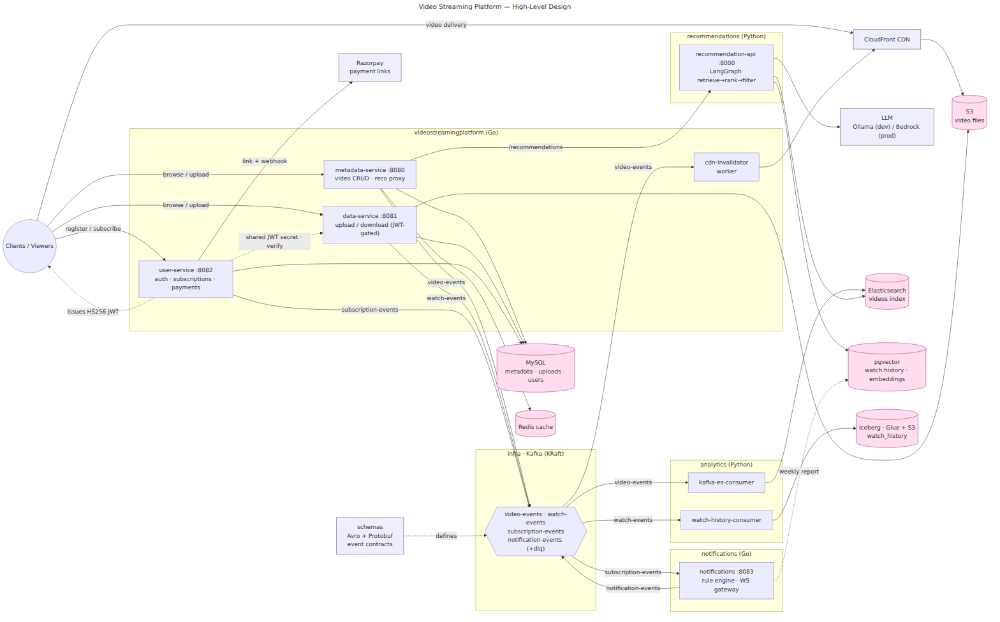

# Video Streaming Platform — Architecture

## Overview

A distributed video streaming platform with HTTP/2 upload/download, an auth + paid-subscription plane, event-driven analytics pipelines, AI-powered recommendations, and a real-time notifications platform. The system spans seven repositories, each independently deployable into its own Kubernetes namespace.

## Repository Map

| Repository | Language | Purpose | K8s Namespace |
|-----------|----------|---------|---------------|
| [videostreamingplatform](https://github.com/rajesh-proddu/videostreamingplatform) | Go 1.25 | Core platform — hosts **three services** (`metadata-service`, `data-service`, `user-service`) + the `cdn-invalidator` worker. Also owns shared `utils/` and AWS platform Terraform. | `videostreamingplatform` |
| [videostreamingplatform-analytics](https://github.com/rajesh-proddu/videostreamingplatform-analytics) | Python 3.11+ | Data pipelines — Kafka→ES sync, watch-history→Iceberg ingestion | `analytics` |
| [videostreamingplatform-recommendations](https://github.com/rajesh-proddu/videostreamingplatform-recommendations) | Python 3.11+ | LangGraph agent — AI-powered video recommendations | `recommendations` |
| [videostreamingplatform-notifications](https://github.com/rajesh-proddu/videostreamingplatform-notifications) | Go | Notifications platform — rule engine + WebSocket gateway; consumes `subscription-events`, emits `notification-events` | `videostreamingplatform` |
| [videostreamingplatform-schemas](https://github.com/rajesh-proddu/videostreamingplatform-schemas) | Avro / Protobuf | Central event schemas + generated code | — (library) |
| [videostreamingplatform-infra](https://github.com/rajesh-proddu/videostreamingplatform-infra) | K8s + Helm + Terraform | Shared infrastructure — Kafka, pgvector, Elasticsearch, Glue, ArgoCD; Helm charts for analytics/recommendations/notifications | `infra` |
| [videostreamingplatform-e2e](https://github.com/rajesh-proddu/videostreamingplatform-e2e) | Go | Black-box integration suites (happypath, resiliency, scale, analytics, recommendations) | — (test harness) |

## System Architecture



*Source: [`diagrams/00-high-level-design.mmd`](diagrams/00-high-level-design.mmd). Regenerate with `mmdc -i 00-high-level-design.mmd -o 00-high-level-design.png -b white -s 2`.*

At a glance:

- **Core platform (Go)** — `metadata-service` (video CRUD, Redis-cached, proxies `/recommendations`), `data-service` (HTTP/2 upload + range download, S3-backed, JWT-gated), `user-service` (auth/JWT, subscriptions, payments), and the `cdn-invalidator` worker (invalidates CloudFront on `VIDEO_DELETED`).
- **Event backbone** — all services produce/consume Kafka (KRaft) topics; schemas are governed centrally by the `schemas` repo.
- **Analytics (Python)** — `kafka-es-consumer` keeps Elasticsearch in sync; `watch-history-consumer` lands watch events in Apache Iceberg (Glue + S3).
- **Recommendations (Python)** — LangGraph agent that retrieves from ES + pgvector, ranks via an LLM (Ollama dev / Bedrock prod), and filters.
- **Notifications (Go)** — consumes `subscription-events`, runs a rule engine, emits `notification-events`, and fans out over a Redis-backed WebSocket gateway.

The K8s/network/storage views live in the companion diagrams [`01`–`04`](diagrams/) and in [KUBERNETES-ARCHITECTURE.md](KUBERNETES-ARCHITECTURE.md).

## Service Details

### Metadata Service (videostreamingplatform)

The control plane for video resources. Exposes REST APIs for CRUD operations on video metadata stored in MySQL. On every create/update/delete, publishes a `VideoEvent` to the `video-events` Kafka topic. Also proxies recommendation requests to the recommendations service via `/recommendations`.

- **Port**: 8080 (HTTP)
- **Storage**: MySQL 8.0 (primary), Redis (cache)
- **Produces**: `video-events` topic
- **Caching**: Redis caches `GetVideo` and `ListVideos` (keys `video:{id}`, `videos:list:{limit}:{offset}`); cache is invalidated on create/update/delete. Nil-safe — service runs without Redis if `REDIS_ADDR` is unset.

### Data Service (videostreamingplatform)

The data plane for video binary content. Supports HTTP/2 chunked uploads with progress tracking and resumability, and range-request downloads with streaming. Also exposes a gRPC interface for programmatic access. On video download, publishes a `WatchEvent` to the `watch-events` Kafka topic.

- **Ports**: 8081 (HTTP/2), 50051 (gRPC)
- **Storage**: S3/MinIO (video files), MySQL (upload state)
- **Produces**: `watch-events` topic
- **Upload store modes**: `UPLOAD_STORE=mysql` (default, production) or `UPLOAD_STORE=memory` (in-memory repository for local dev without MySQL). Chunk size defaults to 5 MB (`streaming.DefaultChunkSize`).
- **Paywall**: `GET /videos/{id}/download` is gated by `middleware.JWTAuth` → `middleware.RequireEntitlement`. Only a **paid** plan carries the entitlement claim.

### User Service (videostreamingplatform)

The auth + paid-subscription plane. Issues HS256 JWTs (with an entitlement claim) via `utils/auth`, manages subscriptions, and handles payments. It is the source of `subscription-events` on Kafka, consumed by the notifications platform. Payment state stays in MySQL — no payment events are emitted.

- **Port**: 8082 (HTTP)
- **Storage**: MySQL (users, subscriptions, `webhook_events` dedupe ledger)
- **Produces**: `subscription-events` topic
- **Routes**: `POST /auth/{register,login,refresh}`, `POST /subscriptions` + `GET /subscriptions/me` (JWT-gated), `POST /webhooks/payment`, `GET /mock/checkout` (mock provider only).
- **Payments**: provider abstraction in `userservice/payment` — default `PAYMENT_PROVIDER=mock` (in-process, emulates the Razorpay envelope + HMAC); real provider is Razorpay Payment Links (one-time payment → 30-day window). The **webhook is the source of truth** (`payment_link.paid`): raw-body HMAC-SHA256 verify, idempotent via the dedupe ledger, plus a reconciliation/stale-pending sweeper.
- **Shared secret**: `JWT_SIGNING_SECRET` is shared with `data-service`, which verifies the tokens this service signs (delivered via the `auth-secrets` k8s Secret).

### Notifications Platform (videostreamingplatform-notifications)

Consumes subscription lifecycle events, evaluates them against a rule engine, emits `notification-events`, and fans notifications out to clients over a WebSocket gateway backed by a Redis backplane. A weekly-report CronJob reads pgvector.

- **Port**: 8083 (HTTP + WebSocket); NodePort 30093 local
- **Consumes**: `subscription-events` topic
- **Produces**: `notification-events` topic (dead-letters to `notification-events-dlq`)
- **Deploys into**: the `videostreamingplatform` namespace; Helm-charted in `videostreamingplatform-infra/charts/notifications`.

### CDN Invalidator Worker (videostreamingplatform)

Lightweight Kafka worker (`workers/cdn-invalidator`) that consumes `video-events` and calls CloudFront `CreateInvalidation` for `/videos/{id}` on `VIDEO_DELETED` (and updates), so the CDN never serves stale objects for removed videos.

- **Consumes**: `video-events` topic
- **Calls**: CloudFront (`CDN_DISTRIBUTION_ID`)

### Kafka→ES Consumer (videostreamingplatform-analytics)

Stateless consumer that keeps Elasticsearch in sync with video metadata. Reads from `video-events`, and indexes/upserts/deletes documents in the `videos` ES index. Uses manual Kafka commits (exactly-once per message).

- **Consumes**: `video-events` topic
- **Writes to**: Elasticsearch `videos` index

### Watch History Consumer (videostreamingplatform-analytics)

Micro-batch consumer that writes user watch events into an Apache Iceberg table for long-term analytics. Buffers 100 records before flushing via PyArrow. Uses AWS Glue as the Iceberg catalog (LocalStack locally).

- **Consumes**: `watch-events` topic
- **Writes to**: Iceberg table `analytics.watch_history` (Parquet/zstd, partitioned by day)

### Catalog Admin (videostreamingplatform-analytics)

CLI tool for Iceberg table lifecycle. Creates tables (K8s Job on initial deploy), runs weekly compaction (CronJob), and supports snapshot expiration. Must run before the watch history consumer starts.

### Core Platform Internal Structure (videostreamingplatform)

Both Go services share a single module (`github.com/yourusername/videostreamingplatform`) and follow a strict 3-layer pattern:

```
handlers/  → HTTP/gRPC entry points, request/response parsing, no business logic
bl/        → Business logic, orchestration (functional options: WithCache, WithKafkaProducer)
dl/        → Data layer interfaces + implementations (MySQL, in-memory)
db/        → Raw database connection setup
models/    → Shared domain structs
```

Dependency direction: `handlers → bl → dl → db`. The `bl` layer depends on `dl` interfaces, not concrete implementations — enabling in-memory substitution for tests.

#### Shared `utils/` packages (imported by both services)

| Package | Purpose |
|---------|---------|
| `utils/config` | Env-driven config (`config.New(serviceName)`). Validates HTTP/gRPC ports and service name. |
| `utils/observability` | Logger, OTel tracing (`InitTracer`), Prometheus metrics (`InitMetrics`). Tracing only initializes when `OTEL_EXPORTER_OTLP_ENDPOINT` is set. |
| `utils/kafka` | `Producer` interface + segmentio/kafka-go impl. Optional — services skip Kafka gracefully if `KAFKA_BROKERS` is empty. |
| `utils/events` | Avro event structs for `VideoEvent` and `WatchEvent`. |
| `utils/cache` | Redis-backed cache. Nil-safe — all methods no-op if `c==nil` or `addr=""`. |
| `utils/middleware` | `ChainMiddleware`, `LoggingMiddleware`, `ErrorHandlingMiddleware`, per-IP token-bucket `RateLimiter`. |
| `utils/recommendations` | HTTP client for the recommendations service (wired in metadataservice only). |
| `utils/errors` | Shared error types. |

#### Rate limiting

All HTTP handlers run through a per-IP token-bucket limiter. Tunable via `RATE_LIMIT_PER_MIN` and `RATE_LIMIT_BURST` env vars.

### Recommendation Service (videostreamingplatform-recommendations)

FastAPI service running a LangGraph agent with three nodes in a linear pipeline:

1. **Retrieve** — Gathers candidates from ES (text search) and pgvector (trending, watch history)
2. **Rank** — Sends candidates + user context to an LLM for relevance scoring (Ollama locally, Bedrock in prod)
3. **Filter** — Removes already-watched videos, enforces min score, applies limit

Also runs a batch embedding job (`make embed`) that scrolls ES videos and stores vector embeddings in pgvector for similarity search.

- **Port**: 8000 (HTTP)
- **LLM**: Ollama (local) / AWS Bedrock (prod)
- **Storage**: pgvector (embeddings + watch history), Elasticsearch (video search)

## Event Architecture

### Topics & Schemas

| Topic | Partitions | Producers | Consumers | Schema |
|-------|-----------|-----------|-----------|--------|
| `video-events` | 3 | Metadata Service | Kafka→ES Consumer, CDN Invalidator | `video_event.avsc` |
| `watch-events` | 6 | Data Service | Watch History Consumer, Recommendations | `watch_event.avsc` |
| `subscription-events` | 3 | User Service | Notifications Platform | `subscription_event.avsc` |
| `notification-events` | 3 | Notifications Platform | WebSocket channels | `notification_event.avsc` |
| `notification-events-dlq` | 1 | Notifications Platform | (manual replay) | — |

### Event Types

**VideoEvent** (`version: "1.0"`):
- `VIDEO_CREATED` — New video metadata created
- `VIDEO_UPDATED` — Video metadata updated
- `VIDEO_DELETED` — Video metadata deleted

**WatchEvent** (`version: "1.0"`):
- `WATCH_STARTED` — User began watching a video
- `WATCH_COMPLETED` — User finished watching

**SubscriptionEvent** (`version: "1.0"`): subscription lifecycle transitions (`SUBSCRIPTION_ACTIVATED`, `SUBSCRIPTION_CANCELLED`, `SUBSCRIPTION_EXPIRED`, `SUBSCRIPTION_EXPIRING`) emitted by User Service.

**NotificationEvent** (`version: "1.0"`): rule-engine output emitted by the Notifications Platform, fanned out to WebSocket channels.

### Schema Management

Schemas live in `videostreamingplatform-schemas` in both Avro (Kafka wire format) and Protobuf (code generation). FORWARD compatibility is enforced by AWS Glue Schema Registry. Evolution rule: add fields with defaults only, never remove or rename.

## Data Stores

| Store | Technology | Database/Index | Owner | Consumers |
|-------|-----------|---------------|-------|-----------|
| Video metadata | MySQL 8.0 | `videoplatform` | Metadata Service | — |
| Video metadata cache | Redis | `video:*`, `videos:list:*` keys | Metadata Service | — |
| Upload state | MySQL 8.0 (or in-memory) | `videoplatform` | Data Service | — |
| Users, subscriptions, payments | MySQL 8.0 | `users`, `subscriptions`, `webhook_events` | User Service | — |
| WebSocket fan-out backplane | Redis | pub/sub channels | Notifications Platform | — |
| Video files | S3 / MinIO | `video-platform-storage` bucket | Data Service | — |
| Video search | Elasticsearch | `videos` index | Kafka→ES Consumer | Recommendations (search) |
| Watch history (analytics) | Apache Iceberg | `analytics.watch_history` | Watch History Consumer | — |
| Watch history (recommendations) | pgvector (Postgres 16) | `watch_history` table | External ingest | Recommendations (history + trending) |
| Video embeddings | pgvector (Postgres 16) | `video_embeddings` table | Embedding batch job | Recommendations (similarity) |
| Iceberg catalog | AWS Glue (LocalStack locally) | `analytics` database | Catalog Admin | Watch History Consumer |
| Schema registry | AWS Glue (LocalStack locally) | `videostreamingplatform` registry | Schemas repo | — |

## Infrastructure & Deployment

### Kubernetes Namespaces

```
Single K8s Cluster
├── argocd             — ArgoCD controller
├── infra              — Kafka (KRaft), LocalStack (Glue), pgvector
├── videostreamingplatform — Metadata/Data/User Service, Notifications, cdn-invalidator, MySQL, MinIO, ES
├── analytics          — Kafka→ES Consumer, Watch History Consumer, Catalog Admin
├── recommendations    — Recommendation Service
└── observability      — Jaeger, Prometheus, Grafana
```

### Network Policies

All namespaces labeled `app.kubernetes.io/part-of: videostreamingplatform` can reach:
- Kafka on port 9092 (all services produce/consume events)
- pgvector on port 5432 (recommendations service)
- LocalStack on port 4566 (Glue Schema Registry)

### GitOps (ArgoCD)

ArgoCD watches the `main`/`master` branch of each repo and auto-syncs with pruning and self-healing enabled.

| ArgoCD App | Source Repo | Source Path | AppProject |
|-----------|------------|-------------|------------|
| `videostreamingplatform` | videostreamingplatform | `k8s/local` | `platform` |
| `infra` | videostreamingplatform-infra | root | `platform` |
| `analytics` | videostreamingplatform-analytics | `k8s` | `data` |
| `recommendations` | videostreamingplatform-recommendations | `k8s` | `data` |
| `notifications` | videostreamingplatform-infra | `charts/notifications` | `platform` |

### Environments

| Environment | Platform | Infra |
|-------------|----------|-------|
| **Local dev** | Docker Compose + Kind | `videostreamingplatform-infra/make up` for shared services |
| **Production** | AWS EKS | Terraform IaC, real AWS Glue/S3, Bedrock for LLM |

### Local Dev Startup Order

```bash
# 1. Shared infrastructure (Kafka, LocalStack, pgvector)
cd videostreamingplatform-infra && make up

# 2. Platform dependencies (MySQL, MinIO, ES, Jaeger, Prometheus, Grafana)
cd videostreamingplatform/build && docker-compose up

# 3. Create Iceberg tables
cd videostreamingplatform-analytics && python catalog-admin/admin.py create-tables

# 4. Start services
cd videostreamingplatform && go run ./metadataservice   # :8080
cd videostreamingplatform && go run ./dataservice        # :8081
cd videostreamingplatform-analytics                      # start consumers
cd videostreamingplatform-recommendations && make dev    # :8000
```

## Observability

| Signal | Tool | Format |
|--------|------|--------|
| **Metrics** | Prometheus + Grafana | OpenTelemetry / Prometheus exposition |
| **Traces** | Jaeger (local) / CloudWatch (AWS) | OpenTelemetry OTLP |
| **Logs** | Structured JSON | Trace ID + Span ID propagated |
| **Health** | `/health` endpoints on all services | Kubernetes liveness/readiness probes |

All Go services use the shared `utils/observability` package for consistent tracing, metrics, and logging initialization.

## Technology Stack

| Layer | Technology |
|-------|-----------|
| Core services | Go 1.25 (net/http, gRPC) |
| Auth & payments | HS256 JWT (shared secret), Razorpay Payment Links (mock provider in dev) |
| Notifications | Go (rule engine + WebSocket gateway, Redis backplane) |
| Metadata cache | Redis |
| Data pipelines | Python 3.11+ (confluent-kafka, PyIceberg, PyArrow) |
| Recommendations | Python 3.11+ (FastAPI, LangGraph, httpx, asyncpg) |
| Streaming | Apache Kafka 3.9 (KRaft mode, no ZooKeeper) |
| Video storage | AWS S3 / MinIO |
| Metadata DB | MySQL 8.0 |
| Search | Elasticsearch 8.x |
| Vector DB | pgvector (Postgres 16) |
| Data lake | Apache Iceberg (Parquet, zstd, Glue catalog) |
| LLM (local) | Ollama (llama3.1) |
| LLM (prod) | AWS Bedrock (Claude 3 Sonnet) |
| Embeddings (prod) | Amazon Titan Embed Text v2 |
| Container orchestration | Kubernetes (Kind local, EKS prod) |
| GitOps | ArgoCD (auto-sync, self-heal) |
| IaC | Terraform |
| CI/CD | GitHub Actions |
| Schema registry | AWS Glue (LocalStack locally) |
| Serialization | Avro (Kafka), Protobuf (gRPC + codegen) |
