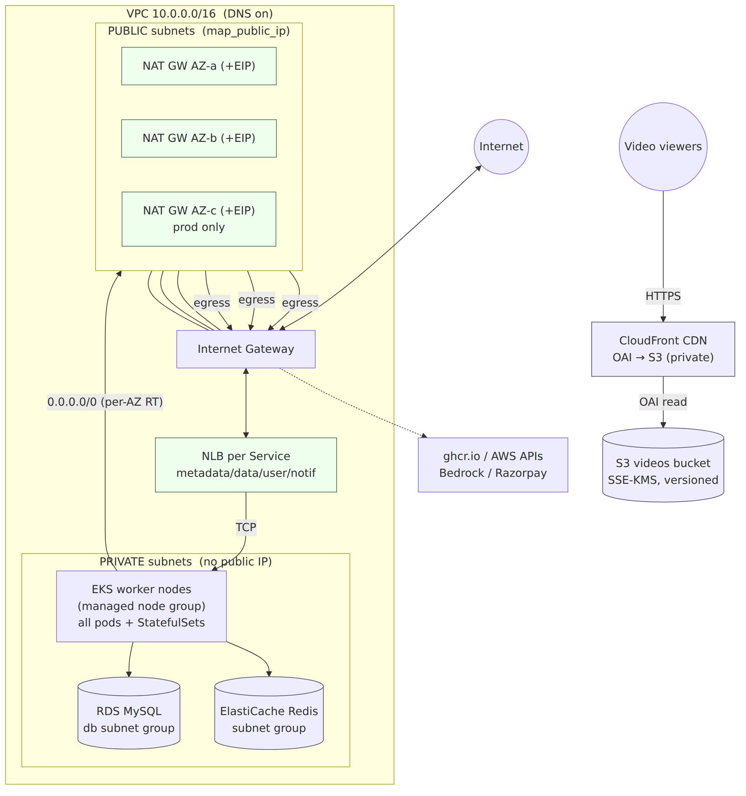
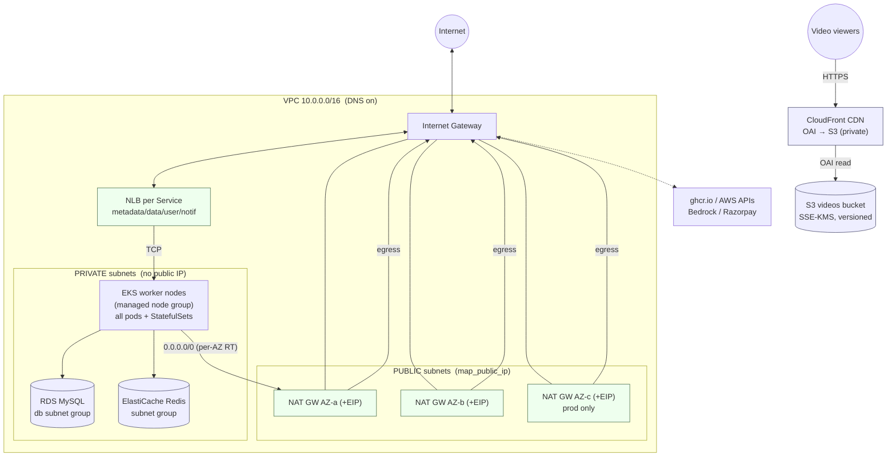
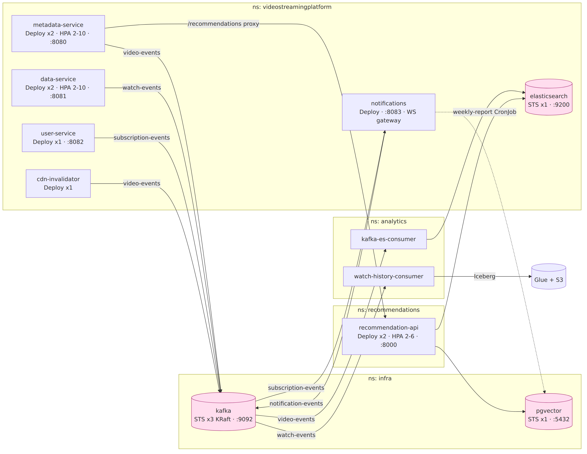
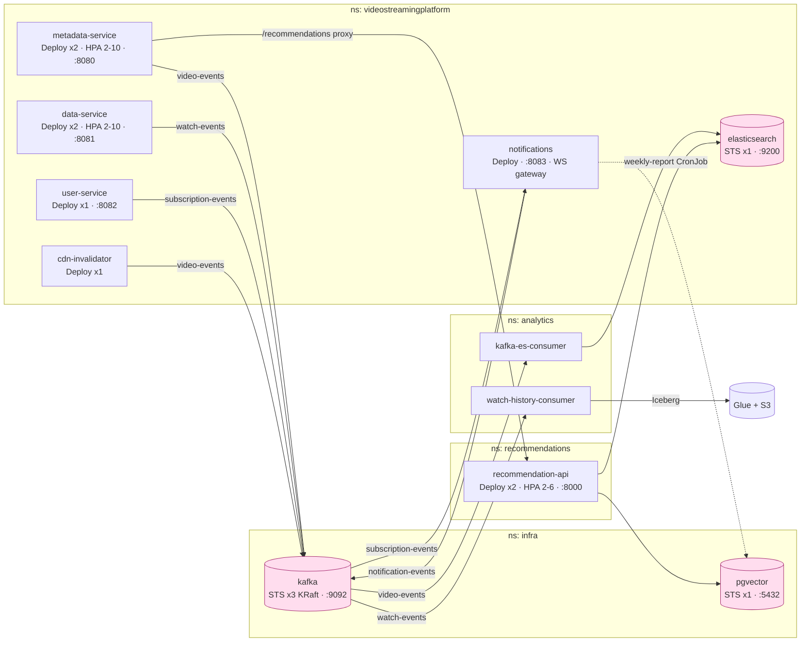
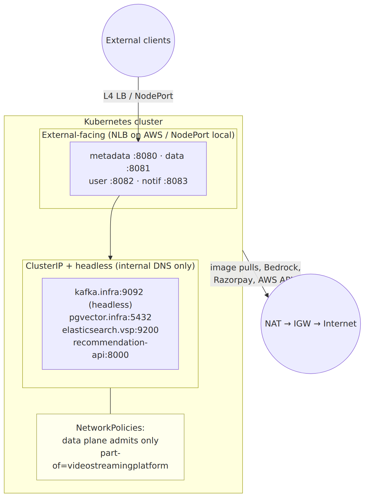
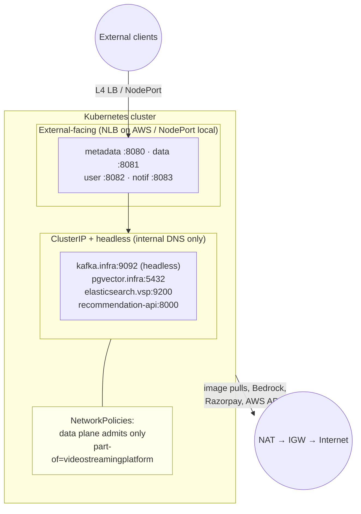
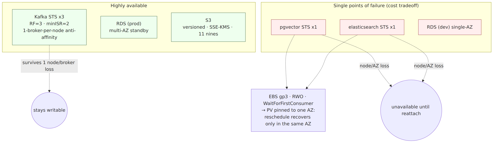
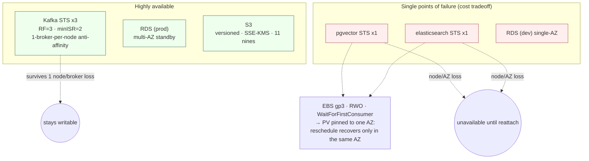

# Kubernetes Architecture — Diagrams

Rendered companions to [`KUBERNETES-ARCHITECTURE.md`](./KUBERNETES-ARCHITECTURE.md).

Each diagram is provided as a **PNG** (primary, always renders) with the **Mermaid source**
in a collapsible block. Editable source also lives beside each image under
[`diagrams/`](./diagrams/) (`*.mmd`) — regenerate PNGs with:

```
npx @mermaid-js/mermaid-cli -i diagrams/<name>.mmd -o diagrams/<name>.png -w 1600 -s 2 -b white
```

---

## 1. AWS network topology (VPC · subnets · IGW · NAT · egress)



**Reads:** NLBs + NAT GWs live in public subnets; nodes/RDS/Redis are private-only.
Egress is node &rarr; **per-AZ NAT** &rarr; IGW (dev 2 NAT GWs, prod 3). Video bytes never
transit the cluster — viewers hit CloudFront, which reads the private S3 bucket via OAI.

<details><summary>Mermaid source</summary>



</details>

---

## 2. In-cluster namespaces, workloads & data flow



**Reads:** Deployments are stateless (pink = StatefulSets). Kafka is the spine —
`video/watch/subscription-events` fan out to analytics, notifications and search.
`recommendation-api` is ClusterIP-only, reached externally only via the metadata-service proxy.

<details><summary>Mermaid source</summary>



</details>

---

## 3. Ingress / egress & DNS boundaries



**Reads:** No Ingress controller exists — L4 only (NLB / NodePort). Internal services are
reachable solely by stable cluster DNS, further fenced by NetworkPolicies. All outbound
egress leaves via the per-AZ NAT path.

<details><summary>Mermaid source</summary>



</details>

---

## 4. Storage & resiliency (failure blast radius)



**Reads:** Kafka (RF=3) and prod RDS (multi-AZ) are the only genuinely HA stores. pgvector
and Elasticsearch run single-replica by design; because EBS volumes are AZ-bound
(`WaitForFirstConsumer`), they recover only if the pod reschedules back into the same AZ.

<details><summary>Mermaid source</summary>



</details>
